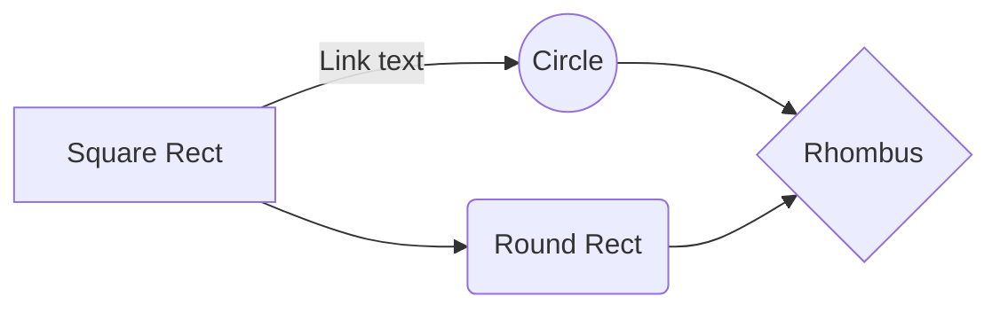

The problem is lack of creativity and vision

The symptom is defering accountability

The enabler is a person who only asks what is asked of them, not what they can do to evolve the understanding.

$a^2 + b^2 = c^2$

$$

\left( \sum*{k=1}^n a_k b_k \right)^2 \leq \left( \sum*{k=1}^n a*k^2 \right) \left( \sum*{k=1}^n b_k^2 \right)

$$

